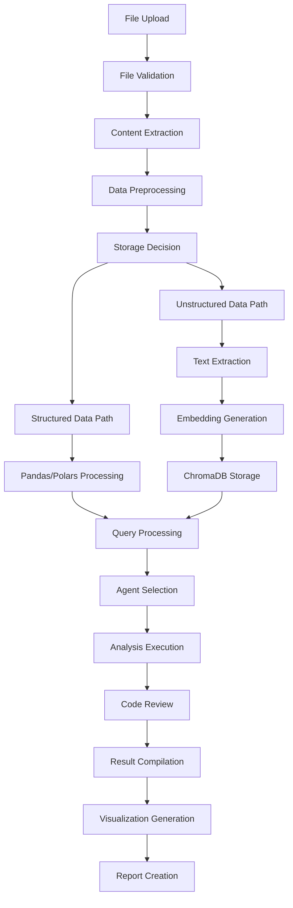

# Nexus LLM Analytics - Technical Architecture Overview

**Version**: 2.1.0  
**Date**: January 2026  
**Author**: Nexus Development Team  
**Repository**: [nexus-llm-analytics](https://github.com/KOTAHARSHA25/nexus-llm-analytics)

---

## 📋 Table of Contents

1. [Executive Summary](#executive-summary)
2. [Architecture Overview](#architecture-overview)
3. [Technology Stack](#technology-stack)
4. [Security Architecture](#security-architecture)
5. [Data Processing Pipeline](#data-processing-pipeline)
6. [Performance & Scalability](#performance--scalability)
7. [Development & Operations](#development--operations)
8. [User Experience Design](#user-experience-design)
9. [Integration Patterns](#integration-patterns)
10. [Monitoring & Observability](#monitoring--observability)
11. [Security Considerations](#security-considerations)
12. [Technical Roadmap](#technical-roadmap)
13. [Configuration Management](#configuration-management)
14. [Deployment Guide](#deployment-guide)

---

## Executive Summary

**Nexus LLM Analytics** is a sophisticated, privacy-first data analysis platform that leverages multiple AI agents to provide natural language-driven analytics. The system is designed with enterprise-grade security, local-first architecture, and intelligent resource management to deliver powerful data insights without compromising privacy or security.

### Key Differentiators
- **🔒 Privacy-First**: All processing happens locally with no external API dependencies
- **🤖 Multi-Agent Intelligence**: 5 specialized AI agents handle different aspects of analysis
- **🛡️ Security-Hardened**: Enhanced sandbox execution with comprehensive security guards
- **🧠 Resource-Aware**: Intelligent model selection based on system capabilities
- **👨‍💻 Developer-Friendly**: Modern stack with comprehensive tooling and documentation

### Business Value
- **Instant Insights**: Natural language queries generate immediate analytics
- **Cost Effective**: No external API costs, runs entirely on local infrastructure
- **Compliance Ready**: Local processing ensures data privacy and regulatory compliance
- **Scalable Architecture**: Designed to handle enterprise-scale data processing needs

---

## 🏗️ Architecture Overview

### Core Design Philosophy

The platform follows a **modular multi-agent architecture** with an intelligent routing layer:

```
┌─────────────────────────────────────────────────────────────────┐
│                        Frontend Layer                          │
│    Next.js 14 + React 18 + TypeScript + Tailwind CSS         │
└─────────────────────┬───────────────────────────────────────────┘
                      │ REST API
┌─────────────────────▼───────────────────────────────────────────┐
│                      Backend Layer                             │
│            FastAPI + Uvicorn + Pydantic                       │
├─────────────────────┬───────────────────────┬───────────────────┤
│   API Endpoints     │    Brain (Core)       │   File Processing │
│   • /analyze/       │    • QueryOrchestrator|   • PDF Extract   │
│   • /upload/        │    • DynamicPlanner   │   • CSV Process   │
│   • /visualize/     │    • CoT Loop         │   • JSON Handle   │
│   • /report/        │    • Security Guards  │   • TXT Process   │
└─────────────────────┼───────────────────────┼───────────────────┘
                      │ Routes Query
┌─────────────────────▼───────────────────────▼───────────────────┐
│                    Multi-Agent System                          │
│                                                                │
├─────────────┬──────────────┬──────────────┬──────────────┬─────┤
│DataAnalyst  │RAG Agent     │Statistical   │Financial     │ML   │
│Agent        │              │Plugin        │Plugin        │Plugin
├───┬─────────┴──────────────┴──────────────┴──────────────┴─────┤
│   │ Dynamic Planning Loop (for complex coding tasks)           │
│   │ Generator Agent <--> Critic Agent                          │
│   └────────────────────────────────────────────────────────────┘
└────────────────────────────────────────────────────────────────┘
```

### Architecture Patterns Implemented

1.  **Orchestrator Pattern**: `QueryOrchestrator` determines the execution path (Agent vs. Planner).
2.  **Chain-of-Thought (CoT)**: `DynamicPlanner` uses a generator-critic loop for self-correcting code generation.
3.  **Plugin Architecture**: Specialized agents (Statistical, Financial) are hot-loadable.
4.  **Secure Sandbox**: `RestrictedPython` execution environment for all generated code.
5.  **Repository Pattern**: Abstracted data access for ChromaDB and Local Storage.

---

## 🎯 Technology Stack

### **Frontend Infrastructure (Modern Web Stack)**

#### Core Framework
| Component | Version | Purpose | Justification |
|-----------|---------|---------|---------------|
| **Next.js** | 14.2.32 | React framework with SSR | Industry standard for React applications, excellent performance |
| **React** | 18.x | UI component library | Most popular UI library, extensive ecosystem |
| **TypeScript** | 5.x | Type-safe JavaScript | Prevents runtime errors, better IDE support |

#### UI/UX Components
| Component | Version | Purpose | Justification |
|-----------|---------|---------|---------------|
| **Radix UI** | Latest | Accessible UI primitives | WAI-ARIA compliant, unstyled components |
| **Tailwind CSS** | 3.4.1 | Utility-first CSS | Rapid development, consistent design |
| **Lucide React** | 0.395.0 | Icon system | Lightweight, customizable icons |
| **React Hook Form** | 7.52.0 | Form management | Performance-optimized form handling |
| **Zod** | 3.23.8 | Schema validation | Type-safe runtime validation |

### **Backend Infrastructure (High-Performance API)**

#### Web Framework
| Component | Version | Purpose | Justification |
|-----------|---------|---------|---------------|
| **FastAPI** | Latest | Async web framework | High performance, automatic API docs, type hints |
| **Uvicorn** | Latest | ASGI server | Production-ready async server |
| **Pydantic** | Latest | Data validation | Type-safe request/response handling |

#### API Architecture
```python
# Core API Endpoints with Purpose
POST /analyze/              # Natural language query processing
POST /upload-documents/     # File upload and preprocessing  
POST /generate-report/      # PDF/Excel report generation
POST /visualize/           # Interactive chart generation
GET  /                     # Health check and service status
```

### **AI & Machine Learning Stack**

#### Large Language Models (Local Hosting)
| Model | Parameters | RAM Requirement | Use Case |
|-------|------------|-----------------|----------|
| **Llama 3.1 8B** | 8 Billion | 6GB+ | Primary analysis, complex reasoning |
| **Phi-3-mini** | 3.8 Billion | 2GB+ | Code review, lightweight analysis |
| **Nomic-embed-text** | - | 0.5GB | Document embeddings, RAG |

#### Multi-Agent Framework Details
```python
# Agent Specialization and Responsibilities
class AgentRoles:
    DATA_ANALYST = {
        'role': 'Senior Data Analyst',
        'expertise': ['pandas', 'polars', 'statistical_analysis'],
        'tools': ['sandbox', 'data_libraries', 'visualization'],
        'responsibilities': [
            'Data manipulation and cleaning',
            'Statistical analysis and insights',
            'Code generation for data operations'
        ]
    }
    
    RAG_SPECIALIST = {
        'role': 'Information Retrieval Expert',
        'expertise': ['vector_search', 'document_analysis', 'context_synthesis'],
        'tools': ['chromadb', 'embedding_models', 'text_processing'],
        'responsibilities': [
            'Document similarity search',
            'Context aggregation from multiple sources',
            'Answer synthesis from retrieved information'
        ]
    }
    
    CODE_REVIEWER = {
        'role': 'Security & Quality Assurance',
        'expertise': ['code_security', 'best_practices', 'vulnerability_detection'],
        'tools': ['ast_analysis', 'security_patterns', 'code_validation'],
        'responsibilities': [
            'Code security validation',
            'Quality assurance checks',
            'Vulnerability detection and prevention'
        ]
    }
```

### **Data Processing & Analytics**

#### High-Performance Data Libraries
| Component | Language | Performance | Use Case |
|-----------|-----------|-------------|----------|
| **Pandas** | Python | Good | General data manipulation, familiar API |
| **Polars** | Rust/Python | Excellent | Large dataset processing, memory efficiency |
| **NumPy** | C/Python | Excellent | Numerical computing, linear algebra |
| **SciPy** | C/Python | Excellent | Statistical functions, scientific computing |
| **Scikit-learn** | Python | Good | Machine learning algorithms |

#### Visualization & Reporting
| Component | Type | Capabilities | Output Formats |
|-----------|------|--------------|----------------|
| **Plotly** | Interactive Charts | Web-based visualizations | HTML, PNG, SVG |
| **ReportLab** | PDF Generation | Professional reports | PDF |
| **OpenPyXL** | Excel Files | Data export | XLSX, CSV |

---

## 🔒 Security Architecture

### **Three-Layer Security Model**

#### Layer 1: Input Validation & Code Analysis
```python
class SecurityLayer1:
    """Pre-execution security validation"""
    
    @staticmethod
    def validate_code(code: str) -> Tuple[bool, str]:
        # AST-based code analysis
        ast_valid, ast_msg = CodeValidator.validate_ast(code)
        
        # Pattern-based security scanning
        pattern_valid, pattern_msg = CodeValidator.validate_code_patterns(code)
        
        # Complexity and size limits
        if len(code) > 10000:  # 10KB limit
            return False, "Code too long"
        
        return ast_valid and pattern_valid, ast_msg or pattern_msg
```

#### Layer 2: Execution Isolation
```python
class SecurityLayer2:
    """Runtime execution control"""
    
    DANGEROUS_MODULES = {
        'os', 'sys', 'subprocess', 'socket', 'urllib',
        'pickle', 'marshal', 'ctypes', 'importlib'
    }
    
    DANGEROUS_BUILTINS = {
        'eval', 'exec', 'compile', '__import__', 'open',
        'input', 'globals', 'locals', 'vars'
    }
    
    @staticmethod
    def create_safe_environment():
        # RestrictedPython compilation
        # Custom security guards
        # Whitelist-based imports
        pass
```

#### Layer 3: Resource Management
```python
class SecurityLayer3:
    """System resource protection"""
    
    @contextmanager
    def limit_resources(max_memory_mb=256, max_cpu_seconds=30):
        # Cross-platform resource limits
        # Memory usage monitoring
        # CPU time restrictions
        # Graceful timeout handling
        pass
```

### **Security Features Implementation**

#### File Upload Security
- **File Type Validation**: Whitelist-based file type checking
- **Size Limits**: Configurable maximum file sizes
- **Content Scanning**: Malware and content validation
- **Secure Storage**: Isolated upload directories with restricted access

#### API Security
- **CORS Configuration**: Configurable allowed origins
- **Request Validation**: Pydantic-based input validation
- **Rate Limiting**: Protection against abuse (planned)
- **Authentication**: API key support (configurable)

---

## 📊 Data Processing Pipeline

### **Comprehensive Data Flow Architecture**



### **Advanced Query Processing System**

#### Natural Language Understanding
```python
class QueryProcessor:
    """Advanced natural language query processing"""
    
    QUERY_INTENTS = {
        'SUMMARIZE': 'Generate data summary and key statistics',
        'VISUALIZE': 'Create charts and visual representations',
        'FILTER': 'Apply conditions to filter data',
        'AGGREGATE': 'Perform grouping and aggregation',
        'CORRELATION': 'Find relationships between variables',
        'PREDICT': 'Generate predictions or forecasts',
        'COMPARE': 'Compare different data segments',
        'TREND': 'Analyze trends over time',
        'DISTRIBUTION': 'Analyze data distributions',
        'OUTLIER': 'Detect anomalies and outliers',
        'JOIN': 'Combine multiple data sources',
        'EXPORT': 'Export processed data',
        'RAG': 'Document-based question answering'
    }
    
    def parse_query(self, query: str, available_columns: List[str] = None) -> QueryParsed:
        # Intent classification with confidence scoring
        # Column extraction and mapping
        # Condition parsing (filters, aggregations)
        # Chart type recommendation
        pass
```

#### Data Processing Capabilities
- **Multi-format Support**: CSV, JSON, PDF, TXT processing
- **Large File Handling**: Streaming and chunked processing
- **Data Validation**: Schema inference and validation
- **Missing Data Handling**: Intelligent imputation strategies
- **Performance Optimization**: Polars integration for large datasets

---

## 🚀 Performance & Scalability

### **Intelligent Resource Management**

#### Smart Model Selection Algorithm
```python
class ModelSelector:
    """Resource-aware model selection"""
    
    MODEL_REQUIREMENTS = {
        "llama3.1:8b": {
            "min_ram_gb": 6.0,
            "recommended_ram_gb": 10.0,
            "capabilities": ["advanced_reasoning", "code_generation"]
        },
        "phi3:mini": {
            "min_ram_gb": 1.0,
            "recommended_ram_gb": 2.5,
            "capabilities": ["basic_reasoning", "code_review"]
        }
    }
    
    @staticmethod
    def select_optimal_models() -> Tuple[str, str, str]:
        memory_info = get_system_memory()
        # Intelligent selection based on available RAM
        # Performance optimization recommendations
        return primary_model, review_model, embedding_model
```

#### Performance Optimizations
- **Lazy Loading**: Component and resource loading optimization
- **Query Caching**: Intelligent result caching at multiple levels
- **Connection Pooling**: Efficient database connection management
- **Async Processing**: Non-blocking request handling
- **Memory Management**: Proactive cleanup and garbage collection

#### Scalability Features
- **Horizontal Scaling**: Multi-instance deployment ready
- **Load Balancing**: API gateway integration prepared
- **Database Sharding**: ChromaDB collection partitioning
- **Caching Layers**: Redis integration ready
- **Microservices**: Independent service scaling

---

## 🔧 Development & Operations

### **Development Environment Setup**

#### Prerequisites
```bash
# System Requirements
Python >= 3.8
Node.js >= 16
npm >= 8
Ollama (for local LLM hosting)

# Recommended System Specs
RAM: 8GB minimum, 16GB recommended
Storage: 20GB available space
CPU: 4+ cores recommended
```

#### Quick Start Guide
```bash
# 1. Clone repository
git clone https://github.com/KOTAHARSHA25/nexus-llm-analytics.git
cd nexus-llm-analytics

# 2. Setup environment
python -m venv env
source env/bin/activate  # or env\Scripts\activate on Windows
pip install -r requirements.txt

# 3. Configure environment
cp config/.env.example .env
# Edit .env with your configurations

# 4. Install Ollama and models
ollama pull llama3.1:8b
ollama pull phi3:mini
ollama pull nomic-embed-text

# 5. Start services
python scripts/launch.py
```

### **Automated Launch System**

#### Comprehensive Startup Script
The `scripts/launch.py` provides:
- **System Requirements Check**: Python, Node.js, Ollama validation
- **Dependency Installation**: Automatic package management
- **Service Orchestration**: Backend and frontend startup
- **Health Monitoring**: Real-time service status checking
- **Graceful Shutdown**: Clean process termination

#### Development Tools
- **Hot Reloading**: FastAPI and Next.js development servers
- **Type Checking**: TypeScript and Pydantic validation
- **Code Formatting**: Black (Python) and Prettier (TypeScript)
- **Testing Framework**: Pytest for backend, Jest for frontend
- **API Documentation**: Automatic OpenAPI/Swagger generation

---

## 🎨 User Experience Design

### **Design System Implementation**

#### Component Architecture
```typescript
// Modern React component structure
interface AnalyticsDashboardProps {
  uploadedFiles: string[];
  onFileUpload: (files: string[]) => void;
  onQuery: (query: string) => void;
}

const AnalyticsDashboard: React.FC<AnalyticsDashboardProps> = ({
  uploadedFiles,
  onFileUpload,
  onQuery
}) => {
  // State management with React hooks
  // Natural language query processing
  // Real-time result updates
  // Interactive visualizations
};
```

#### User Interface Philosophy
- **Natural Language First**: Conversational query interface
- **Progressive Disclosure**: Information revealed based on complexity
- **Responsive Design**: Mobile-first with desktop optimization
- **Accessibility**: WCAG 2.1 compliance through Radix UI
- **Dark/Light Mode**: System preference detection

#### Workflow Optimization
1. **Drag-and-Drop Upload**: Intuitive file handling with progress tracking
2. **Smart Query Suggestions**: AI-powered query recommendations
3. **Real-time Analysis**: Progress updates with execution status
4. **Interactive Results**: Explorable visualizations with export options
5. **Professional Reports**: One-click PDF/Excel generation

---

## 🔄 Integration Patterns

### **External Service Integration**

#### Ollama LLM Integration
```python
class OllamaIntegration:
    """Local LLM service integration"""
    
    def __init__(self, base_url: str = "http://localhost:11434"):
        self.base_url = base_url
        self.client = HTTPClient(base_url)
    
    async def generate_completion(self, model: str, prompt: str) -> str:
        # OpenAI-compatible API calls
        # Streaming response handling
        # Error recovery and fallback
        pass
    
    async def generate_embedding(self, text: str, model: str = "nomic-embed-text") -> List[float]:
        # Vector embedding generation
        # Batch processing optimization
        # Caching for repeated queries
        pass
```

#### ChromaDB Vector Storage
```python
class ChromaDBIntegration:
    """Vector database integration for RAG"""
    
    def __init__(self, persist_directory: str = "./chroma_db"):
        self.client = chromadb.Client(
            Settings(persist_directory=persist_directory)
        )
        self.collection = self.client.get_or_create_collection("nexus_documents")
    
    def add_document(self, doc_id: str, text: str, metadata: dict = None):
        # Document chunking and embedding
        # Metadata indexing
        # Duplicate detection
        pass
    
    def similarity_search(self, query: str, k: int = 5) -> List[Document]:
        # Vector similarity search
        # Result ranking and filtering
        # Context aggregation
        pass
```

### **Internal Module Communication**

#### Event-Driven Architecture
```python
class EventBus:
    """Internal event management system"""
    
    def __init__(self):
        self.subscribers = defaultdict(list)
    
    def subscribe(self, event_type: str, handler: Callable):
        self.subscribers[event_type].append(handler)
    
    async def publish(self, event: Event):
        for handler in self.subscribers[event.type]:
            await handler(event)

# Event types
EVENTS = {
    'FILE_UPLOADED': 'File upload completed',
    'ANALYSIS_STARTED': 'Analysis process initiated',
    'ANALYSIS_COMPLETED': 'Analysis results available',
    'ERROR_OCCURRED': 'Error in processing pipeline'
}
```

---

## 📈 Monitoring & Observability

### **Comprehensive Logging Strategy**

#### Structured Logging Implementation
```python
import logging
import json
from datetime import datetime

class StructuredLogger:
    """JSON-formatted logging with correlation IDs"""
    
    def __init__(self, name: str):
        self.logger = logging.getLogger(name)
        self.setup_handler()
    
    def log_event(self, event: str, **kwargs):
        log_entry = {
            'timestamp': datetime.utcnow().isoformat(),
            'event': event,
            'correlation_id': kwargs.get('correlation_id'),
            'user_id': kwargs.get('user_id'),
            'session_id': kwargs.get('session_id'),
            'data': {k: v for k, v in kwargs.items() 
                    if k not in ['correlation_id', 'user_id', 'session_id']}
        }
        self.logger.info(json.dumps(log_entry))
```

#### Performance Metrics Collection
- **Request/Response Times**: API endpoint performance tracking
- **Model Inference Times**: LLM response time monitoring
- **Memory Usage**: Real-time memory consumption tracking
- **Error Rates**: Success/failure rate monitoring
- **User Activity**: Usage pattern analysis

#### Health Check System
```python
class HealthChecker:
    """System health monitoring"""
    
    async def check_system_health(self) -> HealthStatus:
        checks = {
            'ollama_service': await self.check_ollama(),
            'chromadb_connection': await self.check_chromadb(),
            'file_system': await self.check_file_system(),
            'memory_usage': await self.check_memory(),
            'disk_space': await self.check_disk_space()
        }
        
        return HealthStatus(
            status='healthy' if all(checks.values()) else 'degraded',
            checks=checks,
            timestamp=datetime.utcnow()
        )
```

---

## 🛡️ Security Considerations

### **Data Privacy & Compliance**

#### GDPR/Privacy Compliance
- **Local Processing**: No external data transmission
- **Data Minimization**: Only necessary data collection
- **Retention Policies**: Configurable data cleanup schedules
- **Access Controls**: User-based data access restrictions
- **Audit Trails**: Comprehensive activity logging

#### Security Best Practices
```python
class SecurityBestPractices:
    """Implementation of security standards"""
    
    # Input validation
    def validate_input(self, data: Any) -> bool:
        # XSS prevention
        # SQL injection protection
        # File upload validation
        pass
    
    # Output sanitization
    def sanitize_output(self, data: Any) -> Any:
        # HTML entity encoding
        # Script tag removal
        # Sensitive data masking
        pass
    
    # Session management
    def manage_session(self, session_id: str):
        # Session timeout handling
        # Secure cookie settings
        # CSRF protection
        pass
```

#### Code Execution Security
- **Sandboxed Environment**: RestrictedPython execution
- **Resource Limits**: Memory and CPU constraints
- **Import Restrictions**: Whitelist-based module access
- **Attribute Protection**: Dangerous attribute access prevention
- **Timeout Handling**: Execution time limits

---

## 🔮 Technical Roadmap

### **Phase 1: Foundation Completion (Q4 2025)**
- ✅ Multi-agent system implementation
- ✅ Enhanced security sandbox
- ✅ Smart model selection
- 🔄 CrewAI integration optimization
- 🔄 Advanced RAG capabilities

### **Phase 2: Enterprise Features (Q1 2026)**
- 🔜 Advanced authentication system
- 🔜 Role-based access control
- 🔜 Multi-tenant architecture
- 🔜 Advanced audit logging
- 🔜 SSO integration

### **Phase 3: Scalability & Performance (Q2 2026)**
- 🔜 Distributed processing capabilities
- 🔜 Kubernetes deployment support
- 🔜 Advanced caching layers
- 🔜 Real-time collaboration features
- 🔜 API rate limiting and quotas

### **Phase 4: Advanced AI Features (Q3 2026)**
- 🔜 Multimodal model support
- 🔜 Computer vision capabilities
- 🔜 Advanced ML model training
- 🔜 Custom model fine-tuning
- 🔜 Automated insight generation

### **Phase 5: Integration & Ecosystem (Q4 2026)**
- 🔜 Third-party integrations
- 🔜 Plugin architecture
- 🔜 Marketplace for extensions
- 🔜 Advanced visualization library
- 🔜 Mobile application support

---

## ⚙️ Configuration Management

### **Environment Configuration**

#### Critical Configuration Files
```bash
# Primary configuration files
.env                        # Main environment variables
config/.env.example         # Configuration template
pyproject.toml             # Python project configuration
src/frontend/package.json   # Frontend dependencies
src/backend/main.py        # Application entry point
```

#### Environment Variables Reference
```bash
# Core Application Settings
CORS_ALLOWED_ORIGINS=http://localhost:3000
LOG_LEVEL=INFO
LOG_FILE=logs/nexus.log

# AI Model Configuration
AUTO_MODEL_SELECTION=true
PRIMARY_MODEL=ollama/llama3.1:8b
REVIEW_MODEL=ollama/phi3:mini
EMBEDDING_MODEL=ollama/nomic-embed-text

# Ollama Configuration
OLLAMA_BASE_URL=http://localhost:11434
OLLAMA_API_KEY=not-needed

# Database Configuration
CHROMADB_PERSIST_DIRECTORY=./chroma_db
CHROMADB_COLLECTION_NAME=nexus_documents

# Security Settings
ENABLE_CODE_SANDBOX=true
SANDBOX_TIMEOUT=30
MAX_MEMORY_MB=1024
MAX_FILE_SIZE=100MB

# Performance Settings
ENABLE_MEMORY_OPTIMIZATION=true
MAX_CONCURRENT_ANALYSES=3
CACHE_SIZE_MB=512
```

### **Deployment Configuration**

#### Docker Configuration (Future)
```dockerfile
# Multi-stage Docker build (planned)
FROM python:3.11-slim as backend
WORKDIR /app
COPY requirements.txt .
RUN pip install -r requirements.txt
COPY src/backend ./src/backend

FROM node:18-alpine as frontend
WORKDIR /app
COPY src/frontend/package*.json ./
RUN npm ci --production
COPY src/frontend .
RUN npm run build

FROM python:3.11-slim as production
# Production deployment configuration
```

---

## 🚀 Deployment Guide

### **Production Deployment Checklist**

#### System Requirements
- **Operating System**: Linux/Windows/macOS
- **Python**: 3.8+ (3.11 recommended)
- **Node.js**: 16+ (18 recommended)
- **RAM**: 8GB minimum, 16GB+ recommended
- **Storage**: 20GB+ available space
- **Network**: Internet access for initial setup

#### Security Hardening
```bash
# Production security recommendations
1. Change default passwords
2. Configure firewall rules
3. Enable HTTPS/TLS
4. Set up log monitoring
5. Configure backup systems
6. Implement access controls
7. Regular security updates
```

#### Performance Tuning
```python
# Production performance settings
UVICORN_WORKERS=4
UVICORN_WORKER_CONNECTIONS=1000
MAX_CONCURRENT_REQUESTS=100
CACHE_ENABLED=true
LOGGING_LEVEL=WARNING
DEBUG=false
```

### **Monitoring & Maintenance**

#### Health Monitoring Setup
```bash
# System monitoring commands
curl -f http://localhost:8000/ || exit 1  # Health check
ollama list                               # Model availability
docker ps                                # Container status (if using Docker)
tail -f logs/nexus.log                  # Real-time logs
```

#### Backup & Recovery
```bash
# Data backup procedures
1. ChromaDB data: ./chroma_db/
2. Uploaded files: ./data/uploads/
3. Configuration: .env and config/
4. Logs: ./logs/
5. Reports: ./reports/
```

---

## 📊 System Metrics & KPIs

### **Performance Metrics**
- **Query Response Time**: < 5 seconds for simple queries
- **File Upload Speed**: 10MB/s minimum
- **Memory Usage**: < 80% of available RAM
- **CPU Utilization**: < 70% during normal operation
- **Storage Efficiency**: 50MB per 1000 documents

### **Quality Metrics**
- **Code Coverage**: > 80% test coverage
- **Security Score**: Zero critical vulnerabilities
- **Uptime**: 99.9% availability target
- **Error Rate**: < 1% of requests
- **User Satisfaction**: > 4.5/5 rating

---

## 🤝 Contributing & Community

### **Development Standards**
- **Code Style**: Black (Python), Prettier (TypeScript)
- **Testing**: Pytest (backend), Jest (frontend)
- **Documentation**: Comprehensive inline documentation
- **Version Control**: Git flow with feature branches
- **Code Review**: Mandatory peer review process

### **Community Guidelines**
- **Issue Reporting**: Detailed bug reports with reproduction steps
- **Feature Requests**: Clear use case and business value
- **Pull Requests**: Follow template and include tests
- **Discussion**: Respectful and constructive feedback
- **Documentation**: Update docs with code changes

---

## 📞 Support & Resources

### **Documentation Links**
- **API Documentation**: http://localhost:8000/docs (when running)
- **Frontend Components**: Storybook documentation (planned)
- **Deployment Guide**: Production setup instructions
- **Troubleshooting**: Common issues and solutions
- **FAQ**: Frequently asked questions

### **Contact Information**
- **Repository**: [nexus-llm-analytics](https://github.com/KOTAHARSHA25/nexus-llm-analytics)
- **Issues**: GitHub Issues for bug reports
- **Discussions**: GitHub Discussions for questions
- **Security**: Report security issues privately

---

## 📋 Appendices

### **Appendix A: API Reference**
[Detailed API endpoint documentation with request/response examples]

### **Appendix B: Database Schema**
[ChromaDB collection structure and metadata schema]

### **Appendix C: Security Audit Results**
[Security assessment findings and remediation steps]

### **Appendix D: Performance Benchmarks**
[System performance testing results and optimization recommendations]

---

**Document Version**: 1.0.0  
**Last Updated**: September 16, 2025  
**Next Review**: December 16, 2025  
**Maintainer**: Technical Architecture Team

---

*This document provides a comprehensive technical overview of the Nexus LLM Analytics platform. For the most up-to-date information, please refer to the repository documentation and release notes.*