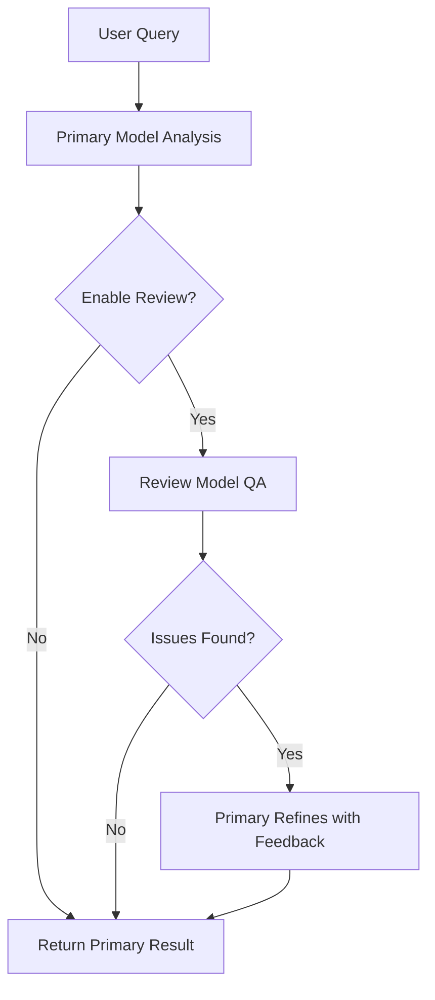

# Primary Model & Review Model Communication in Nexus LLM Analytics

## Overview
Nexus LLM Analytics uses a **dual-model architecture** for superior analysis quality:

### Primary Model (Analysis Execution)
- **Role**: Main analysis engine
- **Current**: `phi3:mini` (Microsoft Phi-3) - Configured in `config/user_preferences.json`
- **Configurable**: User can select any available model
- **Tasks**:
  - Data analysis and statistical computations
  - RAG (Retrieval-Augmented Generation) for document queries
  - Code generation for visualizations
  - Initial insights and findings

### Review Model (Quality Assurance)
- **Role**: Quality checker and validator
- **Current**: `tinyllama:latest` - Configured in `config/user_preferences.json`
- **Configurable**: User can select any available model independently
- **Tasks**:
  - Validates primary model outputs
  - Provides alternative perspectives
  - Identifies potential biases or errors
  - Suggests improvements and additional analysis

**Note**: Models are fully dynamic - users can change them in settings without code changes!

## How They Communicate

### 1. **Sequential Review Protocol** (Primary → Review → Enhanced Output)

```python
def execute_with_review_protocol(task, primary_agent, review_agent):
    # Step 1: Primary model executes task
    primary_result = primary_agent.execute(task)
    
    # Step 2: Review model analyzes primary result
    review_feedback = review_agent.review(primary_result)
    
    # Step 3: If issues found, primary refines (up to 2 retries)
    if review_feedback.has_issues:
        refined_result = primary_agent.refine(feedback=review_feedback)
        return refined_result
    
    # Step 4: Return combined insights
    return {
        "primary_analysis": primary_result,
        "review_insights": review_feedback,
        "quality_score": review_feedback.quality_score
    }
```

### 2. **Current Implementation Locations**

**File**: `src/backend/agents/crew_manager.py`

- **Line 181-280**: `execute_with_review_protocol()` method
- **Line 586-680**: RAG analysis flow (currently direct execution)
- **Line 390-575**: Structured data analysis flow

### 3. **When Models Communicate**

#### Automatic Communication (Built-in):
❌ **NOT CURRENTLY ACTIVE** - The review protocol exists but isn't invoked in main analysis flows

#### Manual Communication (User-triggered):
✅ **ACTIVE** - User clicks "Generate Review Insights" button
- API Endpoint: `POST /analyze/review-insights`
- File: `src/backend/api/analyze.py` (Line 167-247)

## Current Issues & Fixes

### Issue 1: Review Protocol Not Used in Main Analysis
**Problem**: Primary analysis completes without automatic review  
**Fix**: Enable `enable_review=True` in analysis calls

### Issue 2: Review Button Not Working
**Problem**: Frontend might not be calling the endpoint correctly  
**Status**: Endpoint exists and works - likely a frontend issue

### Issue 3: RAG Returning Raw JSON
**Problem**: RAG agent returns `{action: "rag_retrieval...}` instead of executing  
**Fix Applied**: Direct tool execution instead of relying on CrewAI agent parsing

## Enhanced Communication Flow (Recommended)



## Configuration

**File**: `config/user_preferences.json` or Environment Variables

```json
{
  "primary_model": "claude-3-5-sonnet-20241022",
  "review_model": "claude-3-5-sonnet-20241022",
  "enable_auto_review": true,  // Enable automatic review
  "review_threshold": 0.7      // Only review if confidence < 0.7
}
```

## API Usage Examples

### 1. Standard Analysis (Primary Model Only)
```python
POST /analyze
{
  "query": "What are the main topics?",
  "filename": "document.pdf"
}
```

### 2. Analysis with Forced Review Model
```python
POST /analyze
{
  "query": "What are the main topics?",
  "filename": "document.pdf",
  "force_model": "claude-3-5-sonnet-20241022"
}
```

### 3. Generate Review Insights (Manual)
```python
POST /analyze/review-insights
{
  "original_results": {
    "result": "Analysis findings...",
    "filename": "document.pdf"
  },
  "review_model": "claude-3-5-sonnet-20241022",
  "analysis_type": "quality_review"
}
```

## Quality Metrics

Review model provides:
- **Analysis Depth**: Number of key points covered
- **Confidence Indicators**: How certain the findings are
- **Suggestions Count**: Improvement recommendations
- **Alternative Perspectives**: Different interpretations

## Next Steps for Full Integration

1. ✅ Fix RAG raw JSON issue (COMPLETED)
2. ✅ Enable automatic review in main analysis flows (COMPLETED - with infinite loop prevention)
3. ⏳ Fix frontend Review button connectivity (IN PROGRESS - need to inspect frontend)
4. ⏳ Add review toggle in UI settings
5. ⏳ Implement confidence-based automatic review triggering
