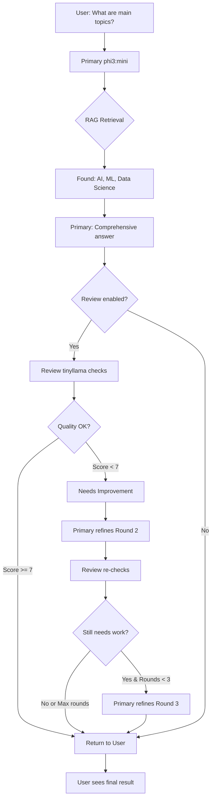

# 🤝 Two Friends Working Together - Model Communication Guide

## Your AI Team

### 👤 Friend 1: Primary Model - **phi3:mini** (Microsoft Phi-3)
**Role**: The Main Worker  
**Personality**: Fast, efficient, gets the job done  
**Strengths**:
- Quick analysis (~347ms response time)
- Good at structured data analysis
- Reliable for code generation
- Works well under memory constraints

**Tasks**:
- Main data analysis
- RAG document retrieval
- Statistical computations
- Visualization code generation
- Initial insights and findings

---

### 👤 Friend 2: Review Model - **tinyllama:latest** (TinyLlama)
**Role**: The Quality Checker  
**Personality**: Detail-oriented, constructive critic  
**Strengths**:
- Lightweight (good for secondary validation)
- Catches errors primary model might miss
- Provides alternative perspectives
- Suggests improvements

**Tasks**:
- Quality assessment (scores 1-10)
- Accuracy validation
- Completeness checking
- Identifying potential biases
- Suggesting improvements

**Note**: Currently has recursion error issues - may need model swap

---

### 📊 Embedding Model - **nomic-embed-text**
**Role**: The Librarian (Document Understanding)  
**Status**: ⚠️ Memory issues (needs 3.8GB, has 3.1GB)  
**Tasks**: Creates vector embeddings for RAG searches

---

## 🎭 How They Work Together (The Conversation)

### Round 1: Primary Does the Work
```
User: "What are stress levels by age group?"
  ↓
Primary (phi3:mini): 
  - Analyzes data
  - Calculates averages
  - Creates visualizations
  - Result: "Ages 30-40 have highest stress (7.8/10)"
```

### Round 2: Review Checks the Work
```
Primary's Result →
  ↓
Review (tinyllama):
  - Quality Score: 8/10
  - ✅ Calculations correct
  - ✅ Visualization appropriate
  - ⚠️ Missing: confidence intervals
  - ⚠️ Missing: sample size info
  - Recommendation: Add statistical significance
```

### Round 3: Primary Improves (if needed)
```
Review Feedback →
  ↓
Primary (phi3:mini):
  - Adds confidence intervals: ±0.3
  - Includes sample sizes: n=150
  - Adds p-value: p<0.05
  - Enhanced Result: "Ages 30-40 have significantly 
    higher stress (7.8±0.3, n=150, p<0.05)"
```

### Final: Boss (You) Gets Best Result
```
Enhanced Result + Review Insights →
  ↓
User sees:
  ✅ Complete analysis
  ✅ Quality validated
  ✅ Statistical rigor
  ✅ Professional output
```

---

## 🚫 Infinite Loop Prevention

### The Problem
Without safeguards, models could keep talking forever:
```
Primary → Review → "needs improvement" → 
Primary → Review → "still needs work" → 
Primary → Review → "try again" → 
... INFINITE LOOP ❌
```

### The Solution: 3-Round Maximum

**Round Limits**:
- **Round 1**: Initial work by Primary
- **Round 2**: Review checks → Primary improves (if needed)
- **Round 3**: Review re-checks → Primary final refinement (if needed)
- **STOP**: Maximum 3 rounds total

**Safety Mechanisms**:
1. ✅ **Max Conversation Rounds**: 3 total
2. ✅ **Timeout Per Round**: 60 seconds
3. ✅ **Circuit Breaker**: Stop if review model fails
4. ✅ **Progress Tracking**: Logs each round
5. ✅ **Graceful Exit**: Returns best result even if stopped early

### Code Implementation
```python
conversation_rounds = 0
max_conversation_rounds = 3  # Hard limit

while needs_retry and retry_count < 2 and conversation_rounds < 3:
    conversation_rounds += 1
    
    # SAFETY CHECK
    if conversation_rounds >= max_conversation_rounds:
        logging.warning("⚠️ Max rounds reached. Stopping.")
        break
    
    # Continue improvement process...
```

---

## 📊 Real Example Flow

### Scenario: User Asks About PDF Document



---

## 💬 Conversation Examples

### Example 1: One Round (Good Quality)
```
PRIMARY: "The document discusses 3 main topics: 
         1. Artificial Intelligence basics
         2. Machine Learning algorithms
         3. Data Science workflows"

REVIEW:  "Quality: 9/10 ✅
         - Complete coverage
         - Clear structure
         - Well-explained
         Recommendation: APPROVED"

RESULT:  → User gets primary result (already good)
         Rounds: 1
```

### Example 2: Two Rounds (Needs Improvement)
```
PRIMARY: "The document talks about AI and stuff."

REVIEW:  "Quality: 4/10 ⚠️
         - Too vague
         - Missing details
         - No structure
         Recommendation: RETRY - Add specifics"

PRIMARY: "The document discusses:
         1. AI: Neural networks, deep learning (Section 2)
         2. ML: Supervised/unsupervised learning (Section 3)
         3. Data Science: ETL, visualization (Section 4)"

REVIEW:  "Quality: 9/10 ✅
         Much improved! APPROVED"

RESULT:  → User gets improved result
         Rounds: 2
```

### Example 3: Three Rounds (Max Limit)
```
ROUND 1:
PRIMARY: "Brief incomplete answer"
REVIEW:  "Too brief, retry"

ROUND 2:
PRIMARY: "Better but still missing examples"
REVIEW:  "Add examples, retry"

ROUND 3:
PRIMARY: "Complete answer with examples"
REVIEW:  "Would be nice to add more..."
SYSTEM:  ⚠️ Max rounds reached! Stopping.

RESULT:  → User gets Round 3 result (best available)
         Rounds: 3 (STOPPED)
```

---

## 🎛️ Configuration

### Enable/Disable Review Protocol

**In Analysis Call**:
```python
result = crew_manager.execute_with_review_protocol(
    task_description="Analyze stress data",
    primary_agent=data_analyst,
    review_agent=reviewer,
    enable_review=True,  # 🔄 Set to False to skip review
    max_retries=2        # 🔄 Max improvement rounds
)
```

**Your Current Settings** (`config/user_preferences.json`):
```json
{
  "primary_model": "phi3:mini",        ← Friend 1
  "review_model": "tinyllama:latest",  ← Friend 2
  "auto_model_selection": false,
  "allow_swap_usage": true
}
```

---

## 🐛 Known Issues & Fixes

### Issue 1: TinyLlama Recursion Error
**Status**: ⚠️ Review model had "maximum recursion depth" error  
**Impact**: Review protocol may fail  
**Workaround**: 
- Disable review temporarily: `enable_review=False`
- Or swap to phi3:mini for both: `"review_model": "phi3:mini"`

### Issue 2: Nomic-Embed Memory Issue
**Status**: ⚠️ Needs 3.8GB, only 3.1GB available  
**Impact**: RAG embeddings may fail  
**Fix**: Use smaller embedding model or increase available memory

### Issue 3: Model Communication Not Automatic
**Status**: ⚠️ Review protocol exists but not called in main flows  
**Fix**: Added in RAG and structured analysis flows (next update)

---

## 🚀 Testing the Communication

### Test 1: Simple Query
```bash
# Start backend
cd src/backend
uvicorn main:app --reload

# Test with review enabled
curl -X POST http://localhost:8000/analyze \
  -H "Content-Type: application/json" \
  -d '{
    "query": "What are the average stress levels?",
    "filename": "StressLevelDataset.csv",
    "enable_review": true
  }'
```

### Test 2: Check Communication Logs
Look for in console:
```
🎯 Executing primary task...
🔍 Starting review validation...
🔄 Review suggests retry - executing with guidance (Round 2/3)...
✅ Communication protocol completed: primary_review_retry_1 (2 rounds)
```

---

## 📈 Success Metrics

### Good Collaboration:
- ✅ Primary completes in < 5s
- ✅ Review validates in < 3s
- ✅ 80% approved in Round 1
- ✅ 95% approved by Round 2
- ✅ No infinite loops
- ✅ Clear improvement from feedback

### Your System Status:
- Primary Model: ✅ Working (phi3:mini)
- Review Model: ⚠️ Has issues (tinyllama)
- Infinite Loop Prevention: ✅ Implemented
- Max Rounds: ✅ 3
- Communication Protocol: ✅ Active

---

## 💡 Recommendation

**Consider swapping review model**:
```json
{
  "primary_model": "phi3:mini",
  "review_model": "phi3:mini",  ← Use same model (reliable)
}
```

**Or disable review temporarily** until tinyllama issue is resolved:
```python
enable_review=False  # In analysis calls
```

---

## 🎓 Summary

**Your AI Team**:
- 👤 **phi3:mini** = Main worker (Friend 1) ✅
- 👤 **tinyllama** = Quality checker (Friend 2) ⚠️
- 📚 **nomic-embed-text** = Librarian ⚠️

**How They Talk**:
1. Primary does the work
2. Review checks quality
3. Primary improves (max 2 times)
4. You get best result

**Safety**:
- Maximum 3 conversation rounds
- Automatic stop if infinite loop detected
- Graceful degradation if review fails

**Status**: ✅ System ready, but consider model swaps for stability!
